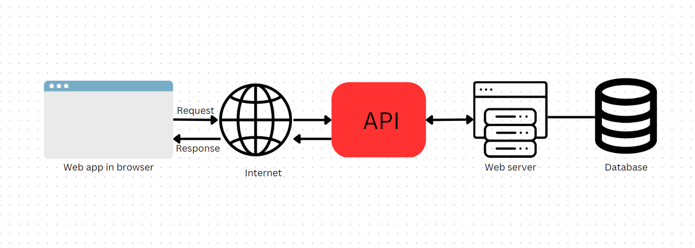

## Objectives
- Understanding the shift from Server-Side Rendering to APIs.
- Building REST API with FastifyJs
## Shifting from Server-Side Rendering to APIs.
### Introduction
In our past workshops, our apps used server-side rendering. With this approach, each request returned an entire HTML page. The problem is that every time we triggered an action in the web app or navigated to a new URL, the server re-rendered the whole page. This means we ended up downloading the full HTML again, even when only a small part of the page had changed.   
This is referred to as a “Hotwire-like” approach, and while it works, it can slow down the application. Often, we only need to retrieve a small piece of data and update a specific section of the page, rather than reloading everything.   
To fix this, we can use an API to send and receive small chunks of data and update just the required parts of the interface.
### API
API (**Application Programming Interface**) is a layer that we add to our web app to connect the frontend with the backend. Our app uses the API to retrieve and send data to the server. The backend receives the data, saves the results, processes whatever is needed, and then returns the updated information to the frontend.    
APIs make it easier to extend our application and make it available on platforms other than the browser. For example, if we want to build a mobile application for our web app, we only need to create the user interface and connect it to our web server using the API. The same backend logic and data can be reused without any changes.    



### Javascript Role
To use the API in our web application, we rely on JavaScript.      
JavaScript handles communication with the server by fetching data from the API and then dynamically updating the DOM to reflect that data.    
Now, instead of submitting a full form and reloading the page, we can let the user type in an input field, click a button, and then:
1. **Catch the click event** with JavaScript
2. **Send a request** to the API    
3. **Receive the response** from the server
4. **Update the DOM** using the data from the response

This way, only the necessary part of the page changes, and our app becomes much faster and smoother.
### REST API Architecture
There are many patterns to design APIs for our web apps, but the most common and beginner friendly one is the REST API.     
REST stands for Representational State Transfer. It is named this way because the server sends a representation of the requested resource usually as JSON, and the client is responsible for handling the state of the application on its side.
### REST Main Properties
REST APIs are defined by several **mandatory constraints** that help achieve scalability, simplicity, and performance in a web service.
#### Stateless
Each request sent to the server must contain all the information needed to process it. The server does not store any information about previous requests.
#### Client–Server Separation
The frontend and backend are separated.  
The frontend focuses only on the user interface and user experience, while the backend handles data storage and business logic.
#### URLs Identify Resources
REST treats everything as a resource (users, tasks, posts, products, etc.).  
Each resource is identified by a clear and meaningful URL, for example:
- `/tasks`
- `/users/1`
#### Use of Standard HTTP Methods
REST relies on standard HTTP methods to describe actions instead of custom commands:
- **GET** Retrieve data
- **POST** Create new data
- **PUT / PATCH** Update existing data
- **DELETE** Remove data

By following these conventions, REST APIs remain predictable, easy to understand, and consistent across different applications.
## Building REST API with Fastify
Now that we understand how REST APIs work, we will apply these concepts by building a Task Management REST API.

The API will be responsible for registering users, authenticating logins, updating user profiles (including name and profile picture), and displaying, editing, and deleting tasks associated with each user.
### Setting Our Envirenment
We start by creating a project directory and initializing a Node.js project. This will generate a package.json file to manage our project dependencies.

```
mkdir myapp
cd myapp
npm init -y
```
### Installing Packages
After initializing the project, it’s time to install the packages required for our Fastify application.   
For this project, we will use **fastify** as the web framework, **handlebars** template engine, **@fastify/session** for session management, **sequelize** as an ORM for database interaction, **dotenv** for environment variables ,and **argon2** for secure password hashing.
```
npm install fastify sequelize handlebars @fastify/view @fastify/static @fastify/session sqlite3 dotenv argon2 @fastify/multipart @fastify/formbody @fastify/cookie
```
### Creating Database Models
Now we move to creating our database models. we only need two core models: the **User** model and the Task model.

The User model represents application users and stores their basic information such as username, password, email, and avatar. The Task model represents tasks created by users, including details like task name, description, creation time, and current state (active or done).

There is a one-to-many relationship between users and tasks:
- A user can have many tasks
- Each task belongs to exactly one user

We will use **Sequelize**  to define our models, we start by creating our models inside models folders

**``models/User.js``**
```js
const { DataTypes } = require('sequelize');

module.exports = (sequelize) => {
  const User = sequelize.define(
    'User',
    {
      id: { type: DataTypes.INTEGER, primaryKey: true, autoIncrement: true },
      username: { type: DataTypes.STRING, allowNull: false, unique: true },
      email: { type: DataTypes.STRING, allowNull: false, unique: true },
      password: { type: DataTypes.STRING, allowNull: false },
      avatar: { type: DataTypes.STRING, allowNull: false },
    },
    {
      tableName: 'users', 
      timestamps: false,
    }
  );

  User.associate = (models) => {
    User.hasMany(models.Task, {
      foreignKey: 'userId',
      as: 'tasks',
      onDelete: 'CASCADE',
    });
  };

  return User; 
};
```
**User Model**
- `id`: Primary key that uniquely identifies each user
- `username`: Unique username for login and identification
- `email`: User email address (also unique)
- `password`: Stores the hashed password (never store plain text passwords)
- `avatar`: Optional field to store a profile picture URL or file path
- `tasks` attribute defines a one-to-many relationship, allowing us to access a user’s tasks using `user.tasks`.


**``models/Task.js``**

```js
const { DataTypes } = require('sequelize');

module.exports = (sequelize) => {
  const Task = sequelize.define(
    'Task',
    {
      id: { type: DataTypes.INTEGER, primaryKey: true, autoIncrement: true,},
      name: { type: DataTypes.STRING, allowNull: false,},
      createdAt: { type: DataTypes.DATE, allowNull: false, defaultValue: DataTypes.NOW,},
      state: { type: DataTypes.STRING, allowNull: false, defaultValue: 'active',},
      userId: { type: DataTypes.INTEGER, allowNull: false,},
    },
    {
      tableName: 'tasks', 
      timestamps: false, 
    }
  );

  Task.associate = (models) => {
    Task.belongsTo(models.User, {
      foreignKey: 'userId',
      as: 'user',
    });
  };
  return Task;
};
```
**Task Model**
- `id`: Primary key for each task
- `name`: Task title
- `createdAt`: Timestamp automatically set when the task is created
- `state`: Represents the task status (`active` or `done`)
- `userId` field is a foreign key that links each task to its owner. This ensures that every task belongs to a valid user.
### Initialize The Database

We create a module to initialize all models and sync the database schema.
**``models/index.js``**
```js
module.exports = (sequelize) => {
  const Task = require('./Task')(sequelize)
  const User = require('./User')(sequelize)
   
  sequelize.sync({ force: true }) 
    .then(() => console.log('Database synced'))
    .catch(err => console.error('Failed to sync database:', err))
  return { User,Task }
}
```
#### Creating Plugins
Now we define the plugins that our app will need
#### Static Plugin
This plugin will handel displaying static files   
**`plugins/static.js`**
```js
const fp = require('fastify-plugin')
const path = require('path')

module.exports = fp(async (fastify, opts) => {
  fastify.register(require('@fastify/static'), {
    root: path.join(__dirname, '../public'),
    prefix: '/static/'
  })
})
```
#### Templates Plugin
Plugin to set the template engine and the views folder.   
**`plugins/templates.js`**
```js
const fp = require('fastify-plugin')
const path = require('path')

module.exports = fp(async (fastify, opts) => {
  fastify.register(require('@fastify/view'), {
    engine: { handlebars: require('handlebars') },
    templates: path.join(__dirname, '../views'),
    includeViewExtension: true,
  })
})
```
#### Sequelize Plugin
Plugin to connect and set our database
**`plugins/sequelize.js`**
```js
const fp = require('fastify-plugin')
const { Sequelize } = require('sequelize')

module.exports = fp(async (fastify, opts) => {
  const sequelize = new Sequelize({
    dialect: 'sqlite',
    storage: 'database.db',
    logging: false
  })
 
  const models = require('../models')(sequelize)

  fastify.decorate('sequelize', sequelize)
  fastify.decorate('models', models)
  
  fastify.addHook('onClose', async (fastify, done) => {
    await sequelize.close()
    done()
  })
})
```
#### Formbody Plugin
Plugin to prase the form data
**`plugins/formbody.js`**
```js
const fp = require('fastify-plugin')

module.exports = fp(async (fastify, opts) => {
  fastify.register(require('@fastify/formbody'))
})
```
#### Multipart Plugin
Plugin that hanndel uplading avatar.   
**`plugins/multipart.js`**
```js
const fp = require('fastify-plugin')
const path = require('path')
const fs = require('fs')

const UPLOAD_FOLDER = path.join(path.dirname(__dirname), 'public/avatars')

const ALLOWED_EXTENSIONS = new Set(['png', 'jpg', 'jpeg', 'gif'])
module.exports = fp(async (fastify, opts) => {
  await fastify.register(require('@fastify/multipart'), {
    limits: {
      fileSize: 5 * 1024 * 1024 
    },
    attachFieldsToBody: true,
  })
  if (!fs.existsSync(UPLOAD_FOLDER)) {
  fs.mkdirSync(UPLOAD_FOLDER, { recursive: true })
}

await fastify.decorate('UPLOAD_FOLDER', UPLOAD_FOLDER)
await fastify.decorate('allowedFile', filename => {
  if (!filename.includes('.')) return false
  const ext = filename.split('.').pop().toLowerCase()
  return ALLOWED_EXTENSIONS.has(ext)
})
})
```
#### Session Plugin
Plugin to register session.   
**`plugins/session.js`**
```js
const fp = require('fastify-plugin')

module.exports = fp(async (fastify, opts) => {
  fastify.register(require('@fastify/cookie'))
  fastify.register(require('@fastify/session'), {
    secret: process.env.SECRET, 
    cookie: {
      secure: false,       
      httpOnly: true,      
      sameSite: 'lax',     
      maxAge: 15 * 60 * 1000 
    },
    saveUninitialized: false
  })
})
```

### Building the REST API
Now it’s time to build our REST API to connect our application with the server and the database. The RESTful API exposes resources as endpoints, allowing the frontend to communicate with our backend using standard HTTP methods.   
For this project, we will work with two main resources:
- **Users** responsible for managing user-related actions such as updating username, password, email, and avatar.    
- **Tasks**  responsible for creating, reading, updating, and deleting tasks that belong to authenticated users.  
All task-related actions require the user to be logged in. We track authentication state using **session**, and the API itself is built using **Fastify routing and controllers** to implement RESTful endpoints.

#### Initial API Setup
We start by configuring Fastify, and registering our plugins.

**``app.js``**
```js
const fastify = require('fastify')({ logger: false })
const path = require('path')
const AutoLoad = require('@fastify/autoload')
require('dotenv').config();

fastify.register(AutoLoad, {
  dir: path.join(__dirname, 'plugins')
})
```
#### Creating Auth Resources
Now let’s start creating our API resources. We begin with the authentication resources, which are responsible for handling user registration and login. These resources manage how users create accounts, authenticate themselves, and start a session with the application.  

**`api/Auth.js`**
```js

const argon2 = require('argon2')
const saveFile = require('../utils')
module.exports = async (fastify, opts) => {
   fastify.post('/api/register', async (request, reply) => {
    
    const password  =  request.body.password.value
    const username  =  request.body.username.value
    const email     =  request.body.email.value
    const hashedPassword = await argon2.hash(password)

    
    const file = await request.body.avatar
    
    if (!file) {
      return reply.status(400).send({ message: 'Include File' })
    }
    
    const {status,avatar} = await saveFile(fastify,file)
    
    if(!status){
        return reply.status(400).send({ message: 'Invalid file type. Allowed: png, jpg, jpeg, gif.' })
    }
    const { User } = fastify.models
    const existingUser = await User.findOne({ where: { username } })
    
    if (existingUser) {
      return reply.status(400).send({ message: 'Username already taken' })
    }

    const user = await User.create({ username,password:hashedPassword,email,avatar})
    await user.save()
    return reply.status(201).send({ message: 'User registered successfully' });
  })

  fastify.post('/api/login', async (request, reply) => {
    const { email,password } = request.body
    const { User } = fastify.models
    const user = await User.findOne({ where: { email } })
    if (!user || !(await argon2.verify(user.password, password))) {
      return reply.status(401).send({ message: 'Invalid email or password' })
    }   
    request.session.userId = user.id
    await request.session.save()
    return reply.send({ message: 'Login successful' });
    
  })
}
```
We defined two authentication API routes using **Fastify Router**. Each route handles incoming **POST** requests and is responsible for a specific authentication action.

The register route receives user data in JSON format from the request body, hashes the user’s password, creates a new user record in the database, and returns a JSON response confirming successful registration.

The login route also receives JSON data from the API request. It searches for the user in the database using the provided email and verifies that the password matches. If the credentials are correct, the user’s ID is stored in the session to mark the user as logged in, and a success message is returned. If the credentials are invalid, the API responds with a **401 (Unauthorized)** status code.

These routes are available at:
- **POST `/api/register`** Register a new user
- **POST `/api/login`** Log in an existing user
#### Creating User Resources
Now that authentication is in place, we can move on to the User resource. This resource is responsible for managing user-related actions after the user is logged in.   
Through the User resource, a logged-in user can view their profile information, update their username or email, change their password, and update their avatar. All these actions require authentication, so the user must have an active session before accessing these endpoints.  
**`api/User.js`**
```js
const argon2 = require('argon2')
const saveFile = require('../utils')
  
module.exports = async (fastify, opts) => {
   fastify.get('/api/user', async (request, reply) => {
        if (!request.session.userId) {
            return reply.status(401).send({ message: 'Unauthorized' });
        }
        const { User } = fastify.models
        const user = await User.findOne({ where: { id: request.session.userId} })
        return reply.status(201).send(
            {
            id: user.id,
            username: user.username,
            email: user.email,
            avatar: 'static/avatars/'+user.avatar,
            });
    });

    fastify.put('/api/user', async (request, reply) => {
        if (!request.session.userId) {
            return reply.status(401).send({ message: 'Unauthorized' });
        }

        
        const username = request.body.username?.value;
        const email = request.body.email?.value;
        const file = await request.body.avatar
        let filename;
        if (file) {
            const {status,avatar} = await saveFile(fastify,file)
            if(!status){
                return reply.status(400).send({ message: 'Invalid file type. Allowed: png, jpg, jpeg, gif.' })
            }
            filename = avatar;
        }
            
            
        const { User } = fastify.models

        await User.update(
        {
        ...(username !== undefined && { username }),
        ...(email !== undefined && { email }),
        ...(filename !== undefined && { avatar: filename }),
        },
        {
        where: { id: request.session.userId },
        }
        );
    return reply.status(201).send({ message: 'User profile updated successfully' });

});

fastify.patch('/api/user/password', async  (request, reply)=> {
    const { password } = request.body;
    const hashedPassword = await argon2.hash(password);
    const { User } = fastify.models
    await User.update(
    { password: hashedPassword },
    {
        where: { id: request.session.userId },
    }
    );
    return reply.status(201).send({ message: 'Password updated successfully'  });


});
}
```
As before, here we defined a **User API resource** using **Fastify**. This resource provides multiple HTTP methods to manage the logged-in user’s profile.    
The GET route retrieves the current user’s information from the database using the user ID stored in the session and returns it as a JSON response.    
The PUT route allows the logged-in user to update their profile data, such as username, email, and avatar. Only the provided fields are updated, while the rest remain unchanged.    
The PATCH `/password` route is used to update sensitive data, such as the user’s password. This action also requires the user to be authenticated.   
These routes will run on the following endpoints:
- **GET `/api/user`** Retrieve the logged-in user’s profile
- **PUT `/api/user`**  Update username, email, or avatar
- **PATCH `/api/user/password`** Change the user’s password
#### Creating Task Resources
Finally, we create the Task resource, which is responsible for managing all task-related actions in our application. This resource allows a logged-in user to create new tasks, view their existing tasks, update task information, and delete tasks.   
Each task is linked to the currently authenticated user using the session, ensuring that users can only access and modify their own tasks. All task endpoints are protected, so the user must be logged in before performing any task operation.   
**``api/Tasks.js``**
```js

const argon2 = require('argon2')
const saveFile = require('../utils')


  
module.exports = async (fastify, opts) => {
  fastify.get('/api/tasks', async (request, reply) => {
    const { Task } = fastify.models
    const tasks = await Task.findAll({ where: { userId: request.session.userId} })
    return reply.status(201).send(
      tasks.map(task => ({
        id: task.id,
        name: task.name,
        state: task.state,
        createdAt: task.createdAt,
      }))
    )
  });
 fastify.post('/api/tasks', async (request, reply) => {
    const { name } = request.body;
    const { Task} = fastify.models
    const task = await Task.create({ name, userId: request.session.userId,})
    await task.save()
    return reply.status(201).send({ message: 'Task created successfully' })
  });

 fastify.put('/api/tasks/:taskId', async (request, reply) => {
    const { taskId } = request.params;
    const { name, state } = request.body;
    const { Task } = fastify.models
    const task = await Task.findOne({ where: { id: parseInt(taskId), userId: request.session.userId} })
    if (!task) {
        return reply.status(401).send({ message: 'Task not found' });
    }
    await Task.update(
        {
        ...(name !== undefined && { name }),
        ...(state !== undefined && { state }),
        },
        {
        where: { id: task.id  },
        }
        );
    return reply.status(201).send({ message: 'Task updated successfully' })
  });
  
  fastify.delete('/api/tasks/:taskId', async (request, reply) => {
    const { taskId } = request.params;
    const { Task } = fastify.models
    const task = await Task.findOne({ where: { id: parseInt(taskId), userId: request.session.userId} })
    if (!task) {
        return reply.status(401).send({ message: 'Task not found' });
    }
    await Task.destroy({
    where: { id: task.id },
    });
    return reply.status(201).send({ message: 'Task deleted successfully' })

  });

}

```
We defined two task-related API routes using **Fastify**:
- The Task List resource handles operations on multiple tasks.
    - **GET `/api/tasks`** retrieves all tasks belonging to the logged-in user.
    - **POST `/api/tasks`** creates a new task and links it to the current user using the session.
- The **Task resource** handles operations on a single task.
    - **PUT `/api/tasks/:taskId`** updates task data such as name or state.
    - **DELETE `/api/tasks/:taskId`** removes a task from the database.

In all cases, tasks are first checked to ensure they belong to the logged-in user. If a task does not exist or belongs to another user, the API returns a **404 (Not Found)** response.
### Creating The Interface
Now that our API is fully functional, we need a user interface to interact with it. Instead of the server rendering HTML pages for every route, we will serve a single HTML file (Single Page Application approach) and use JavaScript to fetch data from our API and update the DOM dynamically.
#### Serving the Entry Point
We need to update our `app.js`, we autoload our api resource and we set the main route to serve the `index.hbs` file.
**``app.js``**
```js
const fastify = require('fastify')({ logger: false })
const path = require('path')
const AutoLoad = require('@fastify/autoload')
require('dotenv').config();

fastify.register(AutoLoad, {
  dir: path.join(__dirname, 'plugins')
})
fastify.register(AutoLoad, {
  dir: path.join(__dirname, 'api')
})

fastify.get('/', async (request, reply) => {
  return reply.view('index')
})


const start = async () => {
  try {
    await fastify.listen({ port: 3000 })
    console.log('Server running at http://127.0.0.1:3000')
  } catch (err) {
    fastify.log.error(err)
    process.exit(1)
  }
}
start()
```
Now, when you visit `http://127.0.0.1:3000/`, Fastify will serve the HTML file, and the rest of the application interaction will happen via JavaScript calling our API endpoints.
#### The HTML and CSS
We created a simple interface with two main sections: a Login section and a Dashboard section. Initially, the dashboard is hidden. After the user successfully logs in, the login section will be hidden, and the dashboard will be displayed.  
We can find the HTML template and styling files inside the ``materials`` folder. The ``index.html`` file should be moved to the ``views`` folder and the ``style.css`` file should be moved to the ``public/css`` folder.  
#### Client-Side Logic (JavaScript)
This is the most important part. The JavaScript file acts as the bridge between HTML events (such as clicks) and the Fastify REST API.  
The code listens for form submissions and button clicks, then makes API calls using fetch to the corresponding endpoints. For example, when a user logs in, it sends a POST request to ``/api/login``, stores the session, and updates the view to display the user’s tasks. Similarly, task actions like creating, updating, or deleting a task are sent to the ``/api/tasks`` endpoints, and the page updates dynamically without reloading.  
Helper functions handle view switching, displaying messages, and ensuring that only logged-in users can access protected sections.   
The file is currently in the ``materials`` folder. We should move it  to the ``public/js`` folder so it can be served as a static asset by Fastify.